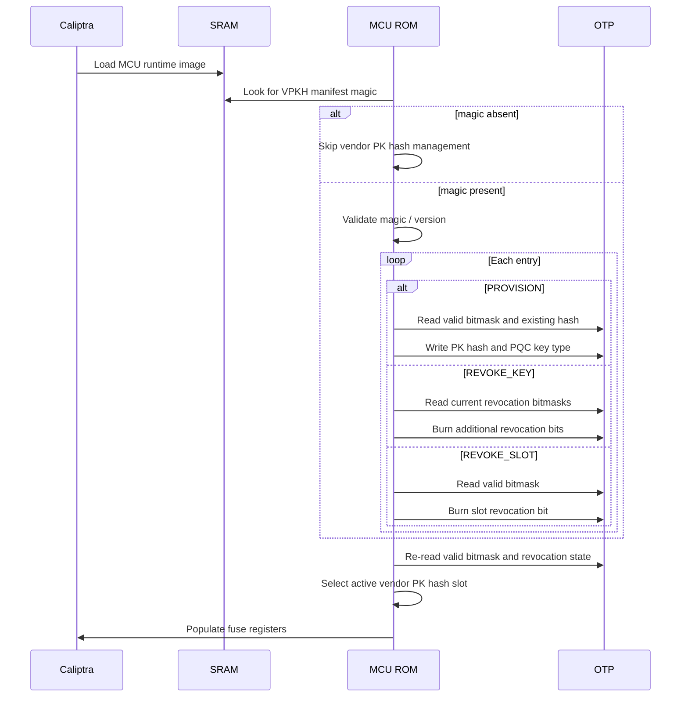

# Vendor PK Hash Management Firmware Header

## Overview

The MCU Vendor PK Hash Management Manifest is an optional header in the
MCU runtime firmware image that allows a firmware release to provision
new vendor public key hashes into OTP fuse slots, revoke individual
signing keys within a slot, or revoke an entire vendor PK hash slot.

Like the [MCU Component SVN Manifest](svn.md#mcu-component-svn-manifest-optional)
and the [Firmware Manifest DOT Section](firmware_format.md#firmware-manifest-dot-section),
this header is authenticated as part of the SoC manifest signature
verification performed by Caliptra Core. MCU ROM processes the manifest
after the firmware image has been loaded and authenticated, before
jumping to the runtime.

Three operations are supported:

1. **Provision** — write a new vendor PK hash and PQC key type to an
   unprovisioned fuse slot.
2. **Revoke Key** — burn additional bits in a slot's ECC, LMS, or MLDSA
   revocation bitmask to revoke individual signing keys within that slot.
3. **Revoke Slot** — burn a bit in `CPTRA_CORE_VENDOR_PK_HASH_VALID` to
   permanently disable an entire vendor PK hash slot.

All operations are **one-way** (fuses only burn 0→1) and
**idempotent** (re-executing a command that has already been applied
is a safe no-op). This makes the manifest safe to leave in place
across reboots and hitless updates.

## Threat Model

Vendor PK hash management via a firmware header addresses several
threat scenarios:

- **Key compromise response.** If a code-signing key is compromised,
  the firmware signer can ship an update that revokes the compromised
  key (via REVOKE_KEY) or the entire vendor PK hash slot (via
  REVOKE_SLOT) before the attacker can exploit it to sign malicious
  firmware. The revocation is permanent once burned.

- **Key rotation.** Over a device's lifetime, the manufacturer may
  need to transition to a new signing key hierarchy. PROVISION allows
  writing a new vendor PK hash to an empty slot, so that subsequent
  firmware updates can be signed with the new keys.

- **Rollback resistance.** Since the manifest is authenticated as part
  of the signed firmware image, an attacker who controls the firmware
  delivery path cannot forge revocation or provisioning commands. The
  SVN anti-rollback mechanism prevents rolling back to a firmware
  version that lacks a critical revocation.

## Fuses

### `CPTRA_CORE_VENDOR_PK_HASH_VALID` Polarity

Despite its name, `CPTRA_CORE_VENDOR_PK_HASH_VALID` has **revocation
polarity**: an **unburnt bit (0) indicates a usable slot**, and a
**burnt bit (1) indicates a revoked/invalidated slot**. This is the
polarity used by the existing ROM vendor key selection logic
(`DefaultVendorKeyPolicy`), and it means that revoking a slot is a
monotonic operation (burning 0→1), which is compatible with OTP
constraints.

No new fuses are required for this proposal. The manifest operates
entirely on existing fuses:

| Fuse | Size per slot | Slots | Purpose |
|---|---|---|---|
| `CPTRA_CORE_VENDOR_PK_HASH_{0..N}` | 384 bits | 16 | Vendor PK hash data (ECC-protected, write-once) |
| `CPTRA_CORE_PQC_KEY_TYPE_{0..N}` | 2 bits | 16 | Per-slot PQC algorithm (MLDSA or LMS) |
| `CPTRA_CORE_VENDOR_PK_HASH_VALID` | 16 bits | — | Slot revocation bitmask (bit=1 → revoked) |
| `CPTRA_CORE_ECC_REVOCATION_{0..N}` | 4 bits | 16 | Per-slot ECC key revocation |
| `CPTRA_CORE_LMS_REVOCATION_{0..N}` | up to 32 bits | 16 | Per-slot LMS key revocation |
| `CPTRA_CORE_MLDSA_REVOCATION_{0..N}` | 4 bits | 16 | Per-slot MLDSA key revocation |

See [ROM Fuses](rom-fuses.md) for the full fuse field reference and
[OTP Encoding Recommendations](rom-fuses.md#otp-encoding-recommendations)
for the recommended layout of each field.

## Format

The manifest is a fixed-size 1024-byte structure identified by a
4-byte magic. The entry section supports up to 16 entries (one per
vendor PK hash slot in the reference fuse map). No checksum is
included — the manifest is authenticated as part of the signed
firmware image.

### Header

| Field | Offset | Size | Description |
|---|---|---|---|
| Magic | `0x00` | 4 B | `0x56504B48` (`"VPKH"`). Stored little-endian: bytes on disk are `48 4B 50 56`. |
| Format Version | `0x04` | 2 B | Manifest format version (must be `1`) |
| Num Entries | `0x06` | 1 B | Number of valid entries (0..16) |
| Reserved | `0x07` | 1 B | Must be zero |

Total header: 8 bytes.

### Entry

Each entry is 60 bytes. Fields unused by a given command must be zero.

| Field | Offset | Size | Description |
|---|---|---|---|
| Command | `0x00` | 1 B | Operation type (see [Commands](#commands)) |
| Slot Index | `0x01` | 1 B | Target vendor PK hash slot (0..15) |
| PQC Key Type | `0x02` | 1 B | PROVISION only: `1` = MLDSA, `2` = LMS. Zero otherwise. |
| ECC Revocation | `0x03` | 1 B | REVOKE_KEY only: bits to OR into `CPTRA_CORE_ECC_REVOCATION_{slot}` (low 4 bits). |
| LMS Revocation | `0x04` | 4 B | REVOKE_KEY only: bits to OR into `CPTRA_CORE_LMS_REVOCATION_{slot}` (up to 32 bits). |
| MLDSA Revocation | `0x08` | 1 B | REVOKE_KEY only: bits to OR into `CPTRA_CORE_MLDSA_REVOCATION_{slot}` (low 4 bits). |
| Reserved | `0x09` | 3 B | Must be zero |
| PK Hash | `0x0C` | 48 B | PROVISION only: SHA-384 hash of the vendor public key. Zero otherwise. |

Total per entry: 60 bytes.

### Reserved

| Field | Offset | Size | Description |
|---|---|---|---|
| Reserved | `0x3C8` | 56 B | Must be zero. Available for future format versions. |

An entry where all fields are zero (`command == 0` / NOP) is treated
as padding and ignored, allowing manifests with fewer than 16 entries
to be zero-padded.

**Total manifest size:** 8 + 16 × 60 + 56 = **1024 bytes**.

### Commands

| Value | Name | Meaning |
|---|---|---|
| `0` | NOP | Padding / no-op. |
| `1` | PROVISION | Provision a new vendor PK hash. Writes the PK hash and PQC key type to the target slot's fuses. The slot must not already contain different hash data. |
| `2` | REVOKE_KEY | Revoke individual signing keys within a slot by burning additional bits in the slot's ECC, LMS, and/or MLDSA revocation bitmasks. |
| `3` | REVOKE_SLOT | Revoke an entire vendor PK hash slot by burning the slot's bit in `CPTRA_CORE_VENDOR_PK_HASH_VALID`. |

Unknown command values cause the ROM to reject the manifest.

### Validation

Header constraints (validated; manifest is rejected on violation):

- Magic must match `0x56504B48`.
- Format version must be `1`.
- `num_entries ≤ 16`.
- Reserved fields must be zero.

Per-entry constraints (validated; entry is rejected on violation):

- `command` must be a known value (0..3).
- `slot_index` must be in range (0..15).
- For PROVISION:
  - `pk_hash` must not be all-zero.
  - `pqc_key_type` must be `1` (MLDSA) or `2` (LMS).
  - Revocation fields must be zero.
- For REVOKE_KEY:
  - `pk_hash` must be zero.
  - `pqc_key_type` must be zero.
  - At least one revocation field must be non-zero.
  - Only the valid bit range of each revocation field may be set
    (ECC: bits `[3:0]`, LMS: up to bits `[31:0]`, MLDSA: bits `[3:0]`).
- For REVOKE_SLOT:
  - All fields except `command` and `slot_index` must be zero.
- For NOP:
  - All fields must be zero.

## ROM Processing

### Loading and Authentication

The manifest is a header in the MCU runtime image, authenticated
together with the runtime by Caliptra Core's signature check on the
SoC manifest. No separate authentication step is needed.

After Caliptra Core loads MCU Runtime into SRAM, MCU ROM looks for the
manifest's magic at the appropriate offset in SRAM (after any
preceding headers such as the
[DOT section](firmware_format.md#firmware-manifest-dot-section)). If
the magic is absent, no manifest processing is performed and the
firmware entry offset is unchanged.

If the magic is present, MCU ROM validates the header, then processes
entries before advancing the firmware entry offset past the manifest
and jumping to the runtime.

### Command Execution

Commands are executed in entry order. Each command re-reads the
relevant fuse state from OTP before acting, ensuring idempotency.

#### PROVISION

1. Read `CPTRA_CORE_VENDOR_PK_HASH_VALID` from OTP.
2. If the slot's bit is set (slot is revoked): fatal error — a
   revoked slot cannot be re-provisioned.
3. Read the existing hash data from `CPTRA_CORE_VENDOR_PK_HASH_{slot}`.
4. If the existing hash is non-zero:
   - Compare against the manifest entry's `pk_hash`.
   - If they match: no-op (already provisioned).
   - If they differ: fatal error (cannot overwrite a different hash).
5. Write the PK hash to `CPTRA_CORE_VENDOR_PK_HASH_{slot}`.
6. Write the PQC key type to `CPTRA_CORE_PQC_KEY_TYPE_{slot}`.
7. Read back to verify.

The hash data and PQC key type fuses are ECC-protected and
write-once. The ROM must not attempt to write these fuses if they
already contain non-zero data (step 4 handles this).

Note that unlike `CPTRA_CORE_VENDOR_PK_HASH_VALID` where bit=0
already means "usable," a newly provisioned slot becomes usable
immediately once its hash and PQC key type are written — no valid-bit
burn is needed.

#### REVOKE_KEY

1. Read the current revocation bitmasks for the target slot from OTP.
2. For each revocation field (ECC, LMS, MLDSA):
   - Compute `new_value = current_value | manifest_value`.
   - If `new_value == current_value`: no-op for this field.
   - Otherwise: burn the new bits.
3. Read back to verify.

#### REVOKE_SLOT

1. Read `CPTRA_CORE_VENDOR_PK_HASH_VALID` from OTP.
2. If the slot's bit is already set (already revoked): no-op.
3. Otherwise: burn the slot's bit to 1.
4. Read back to verify.

### Interaction with Fuse Population

The ROM processes the vendor PK hash management manifest **before**
populating Caliptra's fuse registers. This ensures that any
provisioning or revocation changes are reflected in the fuse values
Caliptra Core sees on this boot:

1. Process vendor PK hash management manifest (provision / revoke as
   needed).
2. Re-read fuse state from OTP.
3. Select the active vendor PK hash slot using the vendor key policy
   (e.g., `DefaultVendorKeyPolicy`).
4. Write the selected slot's hash, PQC key type, and per-key
   revocation bitmasks to Caliptra's fuse registers.

### Hitless Firmware Update

During the **Hitless Firmware Update Flow**, the ROM performs the same
manifest detection and command execution as during cold boot. A new
firmware image delivered via hitless update may carry a different
vendor PK hash management manifest, and its commands are applied on
this boot rather than deferred.

## PLDM Firmware Update — Manifest Verification

When firmware is delivered via PLDM, MCU Runtime should verify the
vendor PK hash management manifest during the **Verify Component**
phase (similar to the SVN checks described in
[SVN PLDM Verification](svn.md#pldm-firmware-update--svn-verification)):

1. If the new firmware image contains a vendor PK hash management
   manifest (identified by magic), validate magic, format
   version, and per-entry constraints.
2. For each PROVISION entry: verify the target slot is not already
   revoked (bit set in `CPTRA_CORE_VENDOR_PK_HASH_VALID`) and does
   not already contain a different hash. Reject the bundle if it
   would cause a fatal error at ROM execution time.
3. For each REVOKE_KEY entry: verify the revocation values are within
   valid bit ranges.
4. For each REVOKE_SLOT entry: no additional pre-check needed (the
   operation is always safe to attempt).

Rejecting the bundle at verify time prevents applying a firmware
image that would cause a fatal error during ROM boot.

## Platform Configuration

### ROM Feature Gate

The vendor PK hash management manifest is gated by:

- **Cargo feature:** `fw-manifest-vendor-pk-hash` on the ROM crate
- **Runtime gate:** a field in `RomParameters` (e.g.,
  `fw_manifest_vendor_pk_hash_enabled`)

A ROM built without the feature ignores the manifest header entirely.
When the feature is enabled but the header is absent from the firmware
image, the ROM proceeds normally without any vendor PK hash
management.

### Slot Selection

Slot selection after manifest processing uses the existing
`VendorKeyPolicy` trait. The `DefaultVendorKeyPolicy` iterates slots
0..15, skipping revoked slots (bit set in
`CPTRA_CORE_VENDOR_PK_HASH_VALID`) and slots whose keys are fully
revoked (all ECC and PQC revocation bits set), then selects the first
functional slot (or the second if PK hash rotation is active).

No changes to the slot selection logic are required — the manifest's
provisioning and revocation operations modify the underlying fuse
state that the existing policy already reads.

## Security Considerations

**Authentication.** The manifest is authenticated as part of the SoC
manifest signature. Only a firmware signer holding the code-signing
key can author provisioning or revocation commands. An attacker who
controls the firmware delivery path but not the signing key cannot
forge these commands.

**One-way commitment.** All operations burn OTP fuses (0→1 only). A
provisioned hash cannot be changed, a revoked key cannot be
un-revoked, and a revoked slot cannot be re-enabled. Recovery from an
incorrect provisioning requires using a different slot. Recovery from
an incorrect revocation is not possible — the device must operate
with the remaining usable slots.

**Rollback interaction.** The firmware's SVN anti-rollback mechanism
prevents rolling back to a version that lacks a critical revocation.
The vendor PK hash management manifest does not carry its own SVN — it
inherits the firmware image's SoC manifest SVN, which Caliptra Core
enforces. Firmware signers should advance the SoC manifest `min_svn`
in the same release that revokes a key, so that devices cannot boot a
pre-revocation firmware after the revocation has been burned.

**Slot exhaustion.** With 16 vendor PK hash slots, a device that
provisions and later revokes slots will eventually exhaust the
available slots. If all slots are revoked or fully key-revoked, the
device has no usable vendor PK hash and cannot boot firmware signed
with vendor keys. Firmware signers must plan provisioning and
revocation carefully over the device's expected lifecycle.

**Provisioning a revoked slot.** The ROM rejects attempts to provision
a slot whose bit is set in `CPTRA_CORE_VENDOR_PK_HASH_VALID`. This
prevents attempting to write hash data to a slot that will never be
selected, and avoids ambiguity about whether a slot with both hash
data and a revocation bit is usable.

**ECC-protected hash fuses.** Vendor PK hash fuses use ECC protection
and are write-once. The ROM must read the slot's current data before
writing and skip the write if data is already present (matching the
manifest entry). Attempting to write a second time to an ECC-protected
field — even with the same data — may or may not succeed depending on
the OTP controller implementation; the ROM avoids this by checking
first.

**Power-loss safety.** For PROVISION, the hash and key type are
written before the slot becomes part of the selection set (the
`CPTRA_CORE_VENDOR_PK_HASH_VALID` bit is already 0 = usable, but the
slot is only functional if it also has valid hash data and a
recognized PQC key type). A power loss mid-write may leave partial
hash data; on the next boot, the ROM will detect that the existing
data does not match the manifest and halt with a fatal error. This is
a conservative design — a partial write to a hash fuse is a permanent
condition that the firmware signer must address by revoking the
corrupted slot and provisioning a new one.

For REVOKE_KEY and REVOKE_SLOT, partial burns only increase the
revocation level (due to OR semantics), so a power loss can never
reduce the security state.

**ROM-only fuse burning.** All fuse operations occur in ROM, before
mutable firmware runs. This is consistent with the SVN anti-rollback
design and ensures that runtime exploits cannot trigger provisioning
or revocation of vendor PK hashes.
