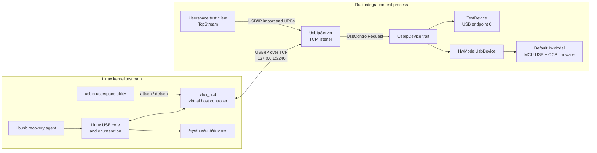
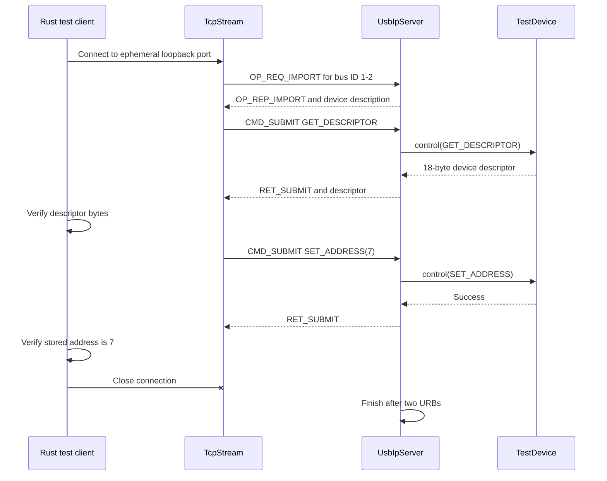
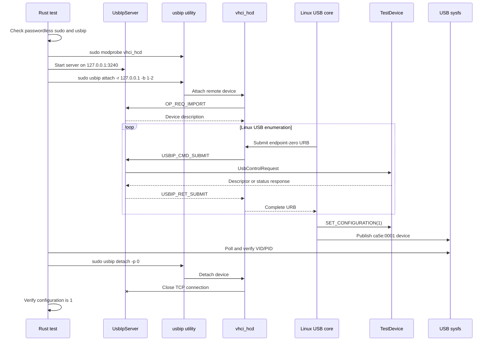
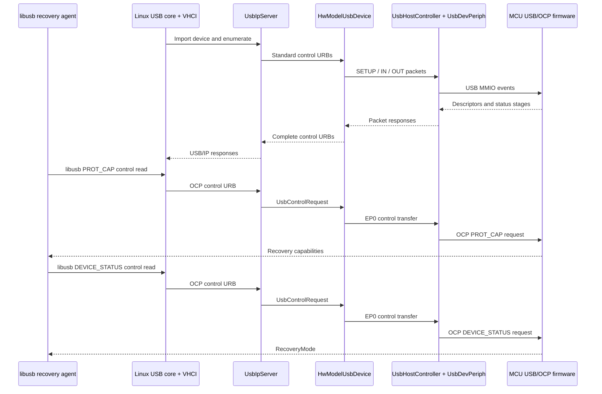
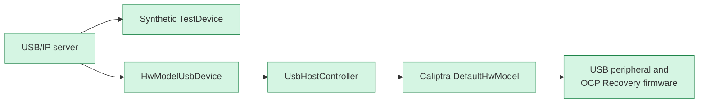

# USB/IP Integration Test Architecture

This directory contains a minimal USB/IP device server and three integration tests. Together, the tests verify the USB/IP protocol directly, through the Linux USB stack, and end-to-end through the Caliptra hardware model and OCP Recovery firmware.

`TestDevice` remains useful for isolated transport tests. `HwModelUsbDevice` connects the same USB/IP server to the emulated Caliptra USB peripheral and MCU firmware.

## Components

### `UsbIpServer`

The server implements the device side of the USB/IP 1.1 protocol. It:

- accepts one TCP connection;
- validates an `OP_REQ_IMPORT` request and returns an `OP_REP_IMPORT` device description;
- handles `USBIP_CMD_SUBMIT` requests for endpoint zero;
- translates each control URB into a `UsbControlRequest`;
- returns `USBIP_RET_SUBMIT` with response data or a stall status;
- handles `USBIP_CMD_UNLINK`; and
- exits cleanly when the client disconnects.

USB/IP header integers use big-endian byte order. The embedded eight-byte USB SETUP packet retains USB little-endian fields.

### `TestDevice`

`TestDevice` implements `UsbIpDevice` and provides enough standard control requests for enumeration:

- `GET_DESCRIPTOR` for device, configuration, and string descriptors;
- `SET_ADDRESS`;
- `GET_STATUS`;
- `GET_CONFIGURATION`; and
- `SET_CONFIGURATION`.

Its test identity is vendor ID `0xca5e`, product ID `0x0001`, and bus ID `1-2`.

### `HwModelUsbDevice`

`HwModelUsbDevice` translates each complete USB/IP control URB into USB packet-level operations on `UsbHostController`. It performs the SETUP, data, and status stages, divides OUT data into 64-byte packets, combines IN packets, and retries temporary NAK responses while MCU firmware executes.

## Test 1: Pure Userspace Protocol Test

`usbip_host_controller_talks_to_emulated_device` validates the USB/IP wire protocol without kernel modules or elevated privileges.

This test isolates protocol encoding, import handling, control request forwarding, and response decoding from Linux USB behavior.

## Test 2: Linux VHCI Enumeration Test

`usbip_linux_vhci_enumerates_emulated_device` exercises the real Linux USB/IP client, virtual host controller, USB core, and enumeration flow.

### Runtime prerequisites

The Linux test requires:

- Linux;
- the `usbip` userspace utility;
- the `vhci_hcd` kernel module; and
- passwordless non-interactive `sudo`.

The test checks these prerequisites at runtime and returns early with a `SKIP:` diagnostic when one is unavailable. Because this is implemented as an early return rather than the Rust test harness's ignored-test mechanism, inspect `--nocapture` output when confirming that the VHCI path actually ran.

## Test 3: libusb OCP Recovery Through the Hardware Model

`usbip_linux_libusb_reads_ocp_recovery_status_from_hwmodel` uses the production-style host path. It boots the hardware model with USB OCP Recovery firmware, imports that device through Linux VHCI, and sends OCP requests with libusb.

This test is equivalent in intent to the direct hardware-model `PROT_CAP` and `DEVICE_STATUS` test, but the host requests traverse libusb, the Linux USB core, VHCI, and USB/IP before reaching the model.

## Running the Tests

From the repository root, run the integration-test package with the `usbip` test-name filter and `--nocapture` to show prerequisite diagnostics.

After a failed or interrupted run, detach any remaining imported device with `sudo usbip detach -p 0`. The normal test path performs this detach before joining the server thread.

## Current Boundary and Future Integration

The current end-to-end path covers enumeration and OCP control reads. Future tests can use the same libusb path for OCP writes, image streaming, activation, malformed requests, and recovery behavior. The host recovery-agent code remains unchanged when USB/IP is replaced by a physical Caliptra device.
